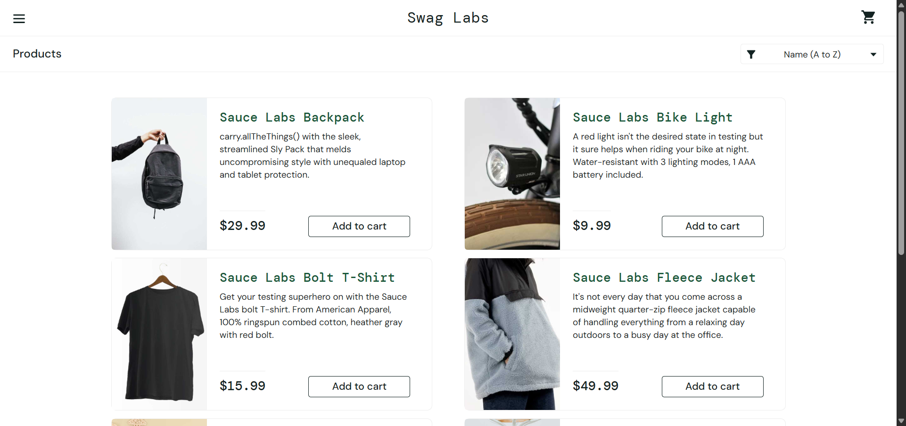
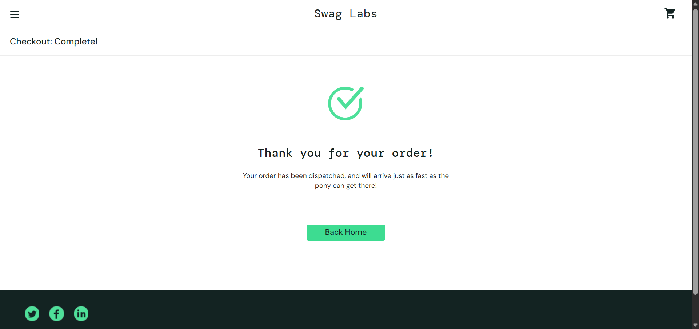

# 🧪 Software Test Automation (Python + Selenium)

Automated test suite for [SauceDemo](https://www.saucedemo.com/) using **Python** and **Selenium**.

---

## 📂 Project Structure

Software-Test-Automation-/
├── chromedriver.exe
├── driver_setup.py
├── screenshots/ ← saved test screenshots
├── tc01_valid_login.py
├── tc02_invalid_login.py
├── tc03_valid_checkout.py
├── tc04_invalid_checkout.py
├── tc05_valid_cart.py
├── tc06_invalid_cart.py
├── tc07_valid_ui_elements.py
├── tc08_invalid_ui_elements.py

yaml
Copy
Edit

---

## ▶️ How to Run Test Cases

Make sure you have Python and Selenium installed:

```bash
pip install selenium
Run any test using:

bash
Copy
Edit
python tc01_valid_login.py
python tc02_invalid_login.py
python tc03_valid_checkout.py
...
✅ Screenshots are saved to the screenshots/ folder.

🖼️ Sample Screenshots
 
🔧 Requirements
Python 3.12+

Google Chrome (latest)

Matching chromedriver.exe

Selenium (pip install selenium)

📌 Author
Karindragi Mahan
GitHub: karindragimhan49
SE3010 - Assignment 02 - Part B

yaml
Copy
Edit

---

### ✅ Steps to add this to GitHub

1. Save the content above to a new file:
   ```bash
   touch README.md
or just create it in VS Code.

Add screenshots to your screenshots/ folder (e.g., tc01_valid_login.png).

Commit and push:

bash
Copy
Edit
git add README.md screenshots/
git commit -m "Add README and screenshots"
git push origin main
